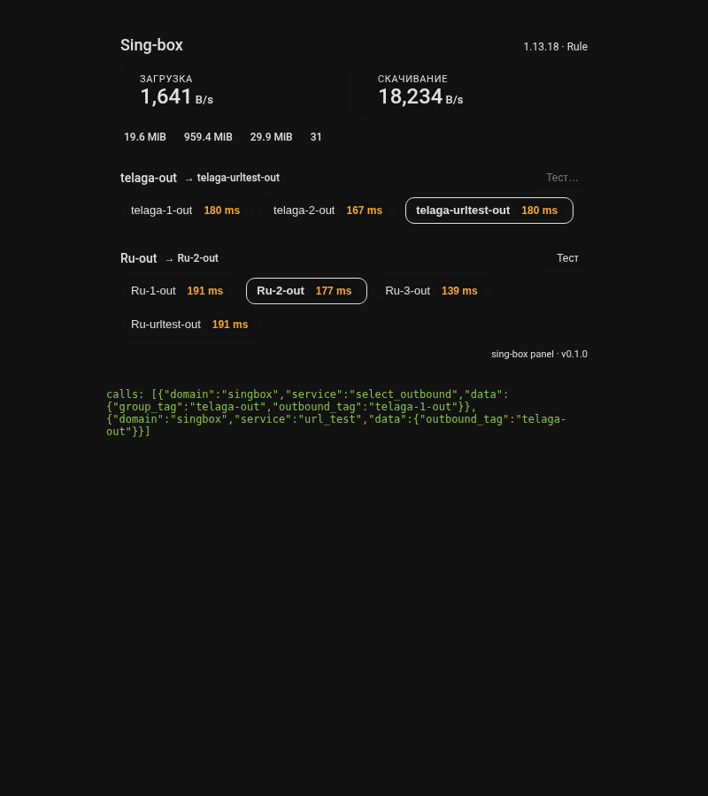

# Sing-box Panel Card

A Lovelace card that turns the [ha-singbox](https://github.com/Ghost-in-the-dark/ha-singbox)
integration into a clean monitoring + control panel for sing-box: live speeds,
traffic totals, per-proxy pings and one-click proxy switching.



## Features

- **Live speeds** — upload / download tiles with the unit configured in the
  integration options (B/s, KiB/s, MB/s, …).
- **Session totals & memory** — download/upload totals, memory usage, active
  connections.
- **Proxy groups** — one block per selector group (`telaga-out`, `Ru-out`, …),
  each proxy rendered as a chip with its last url-test ping (color-coded:
  green ≤ 100 ms, amber ≤ 300 ms, red above).
- **One-click switching** — tap a chip to select that proxy in its group.
- **URL test button** — re-run the group's url-test from the card.
- **Zero configuration** — the card discovers the sing-box entities
  automatically via the entity registry. No entity IDs to type.

## Installation

### HACS (recommended)

1. In HACS go to **Frontend** → **⋮** → **Custom repositories** and add
   `https://github.com/Ghost-in-the-dark/ha-singbox-panel` with category
   **Frontend**.
2. Search for **Sing-box Panel Card** and download it.
3. Reload the Lovelace resources (or refresh the page).
4. Add the resource: **Settings → Dashboards → ⋮ → Resources → Add resource**:
   `/hacsfiles/ha-singbox-panel/singbox-panel-card.js` (type: JavaScript
   Module). This step is automatic in newer Home Assistant versions.

### Manual

Copy `dist/singbox-panel-card.js` into `config/www/` and add the resource
`/local/singbox-panel-card.js` (type: JavaScript Module).

## Usage

Add a manual card with type `custom:singbox-panel-card`:

```yaml
type: custom:singbox-panel-card
title: Sing-box          # optional, default "Sing-box"
# entity: sensor.telaga_1_out_ping   # optional: pin to a specific sing-box
                                    # instance when several are configured
```

No other configuration is needed — groups, pings, speeds and totals are
discovered from the ha-singbox integration automatically.

### Requirements

- The [ha-singbox](https://github.com/Ghost-in-the-dark/ha-singbox) integration
  (≥ 0.3.7, for the ping sensors) configured and running.
- Home Assistant with a recent version (entity registry WS API).

## Development

```bash
npm install
npm run build     # bundles dist/singbox-panel-card.js
npm run dev       # minified build into dist (or BUILD_DEV_PATH)
```

The render smoke test runs the card headlessly against a fake HA object:

```bash
python3 -m http.server 8877 &   # serve the repo root
node tests/stand_check.mjs      # asserts rendering + interactions
```

## License

MIT
